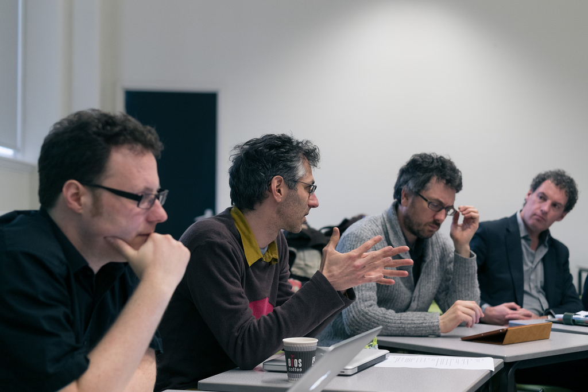
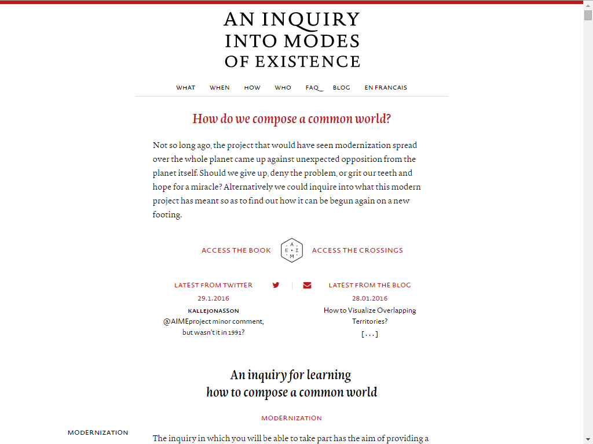

## Modeling a Philosophical Inquiry:<br/>from MySQL to a graph database
*The short story of a long refactoring process*

===

## By Bruno Latour

<p align="center">

</p>
A French philosopher, anthropologist and sociologist of science.

He developed with others the **actor network theory**.
===


The research has received funding from the *European Research Council* under the European Union’s Seventh Framework Programme (FP7/2007-2013) / erc Grant ‘IDEAS’ 2010 n° 269567”

===

## An Inquiry into Modes of Existence
An antropological *inquiry* of
those who call themselves
the moderns.

[a recent publication you can start with.](http://www.modesofexistence.org/anomalie)


===

## An inquiry as a paper book


Or you can read this *book with no footnotes nor glossary* (exists also in English).

===
## a series of workshop

[POL] *workshop at Goldsmith University*, London (09/2014)
===
## a web platform
TODO: image de la home
[](http://modesofexistence.org)
===

<!-- .slide: data-background="img/aime_screencast.gif" data-background-size="1024px" -->

===

<!-- .slide: data-background="img/schema_book-01.png" data-background-size="1024px" -->

===

<!-- .slide: data-background="img/schema_book-02.png" data-background-size="1024px" -->

===

<!-- .slide: data-background="img/schema_mysql_bis-01.svg" data-background-size="1024px" -->

===

<!-- .slide: data-background="img/schema_mysql_bis-02.svg" data-background-size="1024px" -->

===

## neat queries !

```sql
SELECT
  chapter.content_fr AS chapter,
  subchapter.content_fr AS subchapter,
  paragraph.content_fr AS paragraph,
  group_concat(link.id),
  group_concat(link.to_model)
FROM `tbl_items` AS paragraph
LEFT JOIN
  tbl_links as link ON link.from_id = paragraph.id AND
  link.from_model = 1 AND
  link.type in (0,5,6)
LEFT JOIN `tbl_items` AS subchapter ON subchapter.id = paragraph.parent_id
LEFT JOIN `tbl_items` AS chapter ON chapter.id = subchapter.parent_id
WHERE paragraph.root = 36936
AND paragraph.level = 4
GROUP BY paragraph.id
ORDER BY paragraph.lft
```

*And Results come only 6 seconds later on this laptop (without indices)*

===

<!-- .slide: data-background="img/phpmyadmin.png" data-background-size="1024px" -->

===

## and this MySQL

*was wrapped into a PHP/Yii server...*

===

## Multiplication of databases

*So, before refactoring, we had:*

===

### A MySQL Database

For storing a graph, remember...

===

### A Solr index (based on Lucene)

For full-text searching.

===

### A MongoDB

Because we had to create a new frontend...

...and the dev couldn't bare using PHP/MYSQL

*So we added a node.js and a mongo to the stack*

===

### Another MongoDB

wrapped in a python Twisted server for the *bibliographic references*

===

### A SQLite Database

For the Ghost blog's data.

Plus, we needed custom features, so we forked.

The developers left, and now it restarted on its own ~127 times within 3 months...

===

### A Microsoft Access Database

Not on this project...
A story I might tell about at @DH2016 called RICARDO.

===

### Let's sum it up!

===

<!-- .slide: data-background="img/project.png" data-background-size="1000px" -->

===

<!-- .slide: data-background="img/kill.png" data-background-size="1000px" -->

===

### Let's explain our plan to our scientific director


===

## After some failed attempt towards Neo4j...

* winter 2011: first try against pure Lucene for our web crawler
* spring 2012: second try against MySQL for modes of existence (...)
* summer 2012: small experiments by an intern
* summer 2013: new experiments by an other intern called yomgui
* fall   2014: starting implementing Aime in Neo4j !

===

## ... let's use a single database

Now we only have one **neo4j** instance (mostly...) holding the whole inquiry's data.

===

<!-- .slide: data-background="img/migration.png" -->

<h2 class="shadowed-title">Several thousands lines of code later...</h2>

===

## Introducing Neo4j

[Neo4j](http://neo4j.com/) is a graph database.

Which means that instead of storing tables or documents etc. you store an actual graph.

So, knowing the ultra-relational nature of our data, this seems like a good fit.

===

## Migrating

So how do we go from the data model we saw precedently to one that could better fit a Neo4j database?

===

<!-- .slide: data-background="img/neo4j-schema-updated.svg" -->

===

<!-- .slide: data-background="img/neo4j-schema.svg" -->

===

## Problems & choices to be made

1. How do we handle ordered series of links?

2. Are some of our legacy data model's idiosyncrasies now obsolete and harmful to the new one?

3. What about translation?

===

## On the subject of ordered links

1. Chapters have sub-chapters and sub-chapters have paragraphs.

2. You will probably agree that in this case, order is quite important...

3. How do we do so within a graph structure?

===

## Solution n°1 - continuation relationships

```cypher
MATCH (:Chapter)-[:STARTS_WITH]->(:SubChapter)-[:NEXT*1..]->(:SubChapter)
```

**advantages**: feels natural, write is often more performant than with solution n°2 (spoiler!)

**drawbacks**: quite slow to read and to recompose, need to use unbound `[:NEXT*1..]`.

===

## Solution n°2 - relationship properties

```cypher
MATCH (c:Chapter)-[r:HAS]->(s:SubChapter)
WITH r, {
  chapter: c,
  subchapters: collect(s)
} AS chapter
ORDER BY r.order
RETURN chapter
```

**advantages**: easy to read and to compute.

**drawbacks**: might get costly to write depending on where you add a new element.

===

## Other solutions?

Some people maintain that storing ordered list in a graph is sort of a heresy.

===

## Are the documents' slides obsolete?

```cypher
MATCH (:Document)-[:HAS]->(:Slide)-[:HAS]->(:Element)
```

1. Should the slide node become an element?

2. Is this an artifact from both the initial design & data model?

3. Should the document contains its display as whole markdown and keep links to meaningful elements for query purposes?

===

## What about the translation?

1. We could use node properties.

2. Or we could use different nodes & translation links.

3. We chose n°2 because n°1 was the old way in MySQL.

4. Plus this would permit versions to differ (which is already the case).

===

## Monitoring the migration

What one wants to avoid when migrating data from one model to another is obviously to:

* do it comfortably
* ensure that no data is lost or corrupted during the process

We therefore need the proper tools.

===

## On the legacy side

1. Monitoring MySQL & MongoDB is quite easy and the tools are good and numerous.

2. Trusty PHPMyAdmin & Robomongo.

3. Monitoring a graph database is *another problem* altogether.

===

## Neo4j admin

1. Neo4j is a good tool with good UX.

2. Very handy to profile & explain queries as well as understanding how they work and what they return.

3. Can give a fine sense of the local geography of a node or of a small group of nodes.

===

## But...

1. Cannot display large graphs.

2. Only has a basic spring layout.

3. We cannot use *visual network analysis* on our data.

===

## Visual network analysis

1. Graph is the very epitome of complexity.

2. Humans handle complexity very badly.

3. Dataviz to the rescue: [Visual network analysis](http://www.medialab.sciences-po.fr/fr/publications/visual-network-analysis/)

===

## Agent Smith

POC tool designed to visualize *large* graphs resulting from Cypher queries so we can ensure the data migration was going according to plan.

Aims at being a complementary tool to the Neo4j admin.

Obviously a Matrix pun: [Agent Smith](https://github.com/Yomguithereal/agent-smith)

===

## Rendering

1. SVG is very useful if you need to easily customize your visualization.

2. It is very less so when you need performance.

3. Let's try using canvas & WebGL to display our graph (using [sigma.js](http://sigmajs.org/)).

===

## Layout

1. D3's spring layout is more cosmetic than "accurate".

2. Its goal is to ensure a naive anti-collision and an even visual repartition, not layout quality.

3. Let's use [ForceAtlas 2](http://journals.plos.org/plosone/article?id=10.1371/journal.pone.0098679) to give more meaning to our graph' geography.

===

## Use cases

But this remains a bit blurry.

Let's check *two different use cases* to see how visual network analysis can help us spot inconsistencies in our data.

===

<!-- .slide: data-background="img/duplicates.png" -->

```cypher
// Finding duplicates

MATCH (d:Document {original: true})-[rs:HAS]->(:Slide)-[ri:HAS]->(i:Reference)
WHERE not(d:Contribution) AND d.title =~ "(?i).*\\d{4}.*"
WITH d, ri, count(rs) AS nbs
WHERE nbs = 1
WITH d, count(ri) AS nbi
WHERE nbi = 1
MATCH (d)-[rs:HAS]->(s:Slide)-[ri:HAS]->(i:Reference)
RETURN d, rs, s, ri, i;
```

Note: convoluted query

===

<!-- .slide: data-background="img/balloons.png" -->

```cypher
// Finding errors in link generation

MATCH (n:`Mode`) WITH n LIMIT 100 MATCH (n)-[r]-(t) RETURN n,r,t;
```

===

<!-- .slide: data-background="img/issue.png" -->

===

<!-- .slide: data-background="img/fixed.png" -->

===

So now, we have the following

```cypher
MATCH ()-[bc:HAS]->(c:Chapter)-[csc:HAS]->(sh:Subheading)-[shp:HAS]->(p:Paragraph)-[:CITES]->(t)
WHERE c.lang = "fr"
WITH
  bc, csc, shp, c, sh, p, t,
  collect(t.type) as to_type,
  collect(t.slug_id) as to_id
RETURN
  c.title,
  sh.title,
  p.markdown,
  to_type,
  to_id
ORDER BY bc.order, csc.order, shp.order
```

===

## From philosophy to history: a slightly different use-case


1. *find the connections* between people in pictures, letters and official documents dealing with the *European Integration process*

1. Integrate the *existing workflow*: exploration, data curation, publication


===

## First chance to see: collecting the co-occurrences

Display with [Agent Smith](https://github.com/Yomguithereal/agent-smith) the result of automatic disambiguation on text documents with [yago-aida](https://www.mpi-inf.mpg.de/departments/databases-and-information-systems/research/yago-naga/aida/) (@max plank institute)

===

<!-- .slide: data-background="img/schema_annotation-01.png" data-background-size="1024px" -->

===

```cypher
// letters vs people mentioned
MATCH p=(res:resource {type:'letter'})<--(per:person)
RETURN p
```
<!-- .slide: data-background="img/person-vs-letters.png" data-background-size="1024px" -->

---

<!-- .slide: data-background="img/person-vs-letters.png" data-background-size="1024px" -->

===

```cypher
// pictures vs people appearing in the picture
MATCH p=(n:person)-->(res:resource {type:'picture'})
WHERE n.score > -1
RETURN p LIMIT 10000;
```

<!-- .slide: data-background="img/people-in-picture-zoomout.png" data-background-size="1024px" -->

---

<!-- .slide: data-background="img/people-in-picture-zoomout.png" data-background-size="1024px" -->

---

<!-- .slide: data-background="img/people-in-picture-zoomin.png" data-background-size="1024px" -->

===

<!-- .slide: data-background="img/schema_annotation-03.png" data-background-size="1024px" -->

---

```cypher
// Making use of multilinguistic analysis: preliminary data curation
MATCH p=(n:person)-[r]->(res:resource {type:'picture'})
WHERE length(r.languages) <> length(res.languages)
AND n.score > -1
RETURN p LIMIT 10000;
```
<!-- .slide: data-background="img/spot-error-multil.png" data-background-size="1024px" -->

---

<!-- .slide: data-background="img/spot-error-multil.png" data-background-size="1024px" -->

---

<!-- .slide: data-background="img/spot-error-multil-bis.png" data-background-size="1024px" -->


===

## Graph visualizations can easily become entry points for (fast) data curation

1. asymmetries and errors during the analysis process

2. easily spot *well placed* false positives

3. fulltext lucene search

===

```cypher
// annotation errors
```

<!-- .slide: data-background="img/spot-annotation-errors-in-central-position.png" data-background-size="1024px" -->

---

<!-- .slide: data-background="img/spot-annotation-errors-in-central-position.png" data-background-size="1024px" -->

===

```cypher
// spot well placed false positives
```

<!-- .slide: data-background="img/spot-annotation-error-false-positive.png" data-background-size="1024px" -->

---

<!-- .slide: data-background="img/spot-annotation-error-false-positive.png" data-background-size="1024px" -->

===

## monopartite projections

===

```cypher
// people co-mentions, jaccard similarity
MATCH p=(n)-[r:`appear_in_same_document`]-(t)
WHERE n.score > -1 AND t.score > -1
WITH p ORDER BY r.intersections DESC, r.jaccard DESC
RETURN p LIMIT 1000;
```
<!-- .slide: data-background="img/generic-cooccurrence.png" data-background-size="1024px" -->

---

<!-- .slide: data-background="img/generic-cooccurrence.png" data-background-size="1024px" -->

===

## what about the meaning of a **relationship** ?

Recognize with the researchers *other kind of relationships*, visually.

===

```cypher
// people co-mentions in "pictures"
MATCH (n:person)-->(res:resource {type:'picture'})<--(t:person)
WHERE n.score > -1 AND t.score > -1
WITH n, t
MATCH p=(n)-[r:`appear_in_same_document`]-(t)
WITH p ORDER BY r.intersections DESC, r.jaccard DESC
RETURN p LIMIT 1000;
```

<!-- .slide: data-background="img/picture-cooccurrence.png" data-background-size="1024px" -->

---

<!-- .slide: data-background="img/picture-cooccurrence.png" data-background-size="1024px" -->

---


```cypher
// people co-mentions in "letters"
MATCH (n:person)-->(res:resource {type:'letter'})<--(t:person)
WHERE n.score > -1 AND t.score > -1
WITH n, t
MATCH p=(n)-[r:`appear_in_same_document`]-(t)
WITH p ORDER BY r.intersections DESC, r.jaccard DESC
RETURN p LIMIT 1000;
```

<!-- .slide: data-background="img/letter-cooccurrence.png" data-background-size="1024px" -->

---

<!-- .slide: data-background="img/letter-cooccurrence.png" data-background-size="1024px" -->

===


## Graphs vis reveal the (ductile) structure of the data

There is (almost) no difference/distance between the **represented** structure and the **db** structure

Finally, we can open up the database *creation* process


===

## Neo4j Feedback (1/3)

1. Cypher is clearly the main selling point.

2. Output constraints sometimes.

3. Lack of maintenance tools with the community edition.

Note: huge work done on the output, contrary to SQL. Shame it's not complete :)

Note: hidden O(n^2) hidden queries.

===

## Neo4j Feedback (2/3)

1. Cypher hides a lot of complexity for you.

2. Sometimes it's good for you (cardinality).

3. Sometimes it's not and you have trouble handling complex queries that end up in cartesian products where they really should not.

===

## Neo4j Feedback (3/3)

1. simplify plugins installation (for designers ...?): something like a package manager.

2. Not necessarly a performance choice but a semiotic one networks are powerfull semiotic objects to think data (ADD prof IEP reference)


Note: Paul => reference

===

## Back to the future

1. [decypher](https://github.com/Yomguithereal/decypher#readme), a handful of node.js utilities to handle cypher queries.

2. Quinoa editor.

3. TOFLIT18 & its scalability issues - Cf. Benoît Simiard FOAF @jacomyal invitaiton to talk
