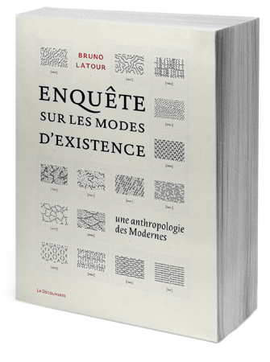

## Modeling a Philosophical Inquiry: from MySQL to a graph database
*The short story of a long refactoring process*

===

## An Inquiry into Modes of Existence
An phylosophical inquiry to...

===

## A paper book

===

<!-- .slide: data-background="img/aime_screencast.gif" data-background-size="1024px" -->

===

## Data model of the inquiry

===

## MySQL & graphs

How do we store a complex tree within MySQL tables?

===

## Multiplication of databases

So, before refactoring, we had:

===

### A MySQL Database

For storing a graph, remember...

===

### A Solr index (based on Lucene)

For full-text searching.

===

### A MongoDB

For a second view on already existing data.

===

### Another MongoDB

For textual references etc.

===

### A SQLite Databse

For the blog's data.

===

### A Microsoft Access Database

Just kidding... (At least not on this project)

===

## Towards a single database

Now we only have one **Neo4j** instance (mostly...) holding the whole inquiry's data.

===

<!-- .slide: data-background="img/project.png" data-background-size="1000px" -->

===

<!-- .slide: data-background="img/kill.png" data-background-size="1000px" -->

===

## The long trip towards Neo4j

* Heiko
* Heikki
* Dor
* Yomgui

Note: pom, where?

===

## Introducing Neo4j

===

## Graph visual analysis

===

## Agent Smith

Matrix pun FTW (old & new admin) (two examples)

Note: The tool is a POC and does not aim at replacing Neo4j's already good admin.

===

## Migrating
intéret de la viz dans le travail de migration

===

## On the subject of ordered links

* `[:FOLLOWS]` relationships
* Relationships attributes

Note: develop

===

## refacto du cliebt 4 vers 3 colonnes
la stack cliente, la décroissance, la performance

comparaison du temps de chargement des deux versions (ancienne version dipo en interne)

===

## From philosophy to history: a slightly different use-case

1. *find the connections* between people, pictures, letters and official documents dealing with the *European Integration process*

1. Integrate graph databases and graph visualizations in the existing workflow and research practices.

===

## First chance to see: collecting the cooccurrences

---

Display with **agent-smith** the result of automatic disambiguation on text documents with **[yago-aida](link)**

---

  (image)

---

Recognize with the researchers *other kind of relationships*, visually, and add them easily:

---

  (image)

---

Towards a *better understanding* of what a **relationships** means

===

## Can graph visualizations become entry points for (fast) data curation?

1. asymmetries and errors during the analysis process

1. easily spot *well placed* false positives

1. fulltext lucene search

===

## Can Graphs visualization serve as entry points for humanitites researchers to better structure data?

Graphs as bridges / obstacles between a designer and the researchers needs

===

## Graphs vis reveal the (ductile) structure of the data

There is no difference/distance between the **represented** structure and the **db** structure

Finally, we can opened up the database *creation* process

===

## Graphs are tools

shift towards idea of *networks as constructs*, merely built-up representation;

Graphs should not be the **final-chance-to-see**

===

## Neo4j Feedback

simplify plugins installation (for designers ...?): something like a package manager

===

## Neo4j Feedback

(probably more slides)

* Cypher as the main selling point
* Maintenance difficulties concerning the community edition

===

## Back to the future

Quinoa / Dolman / Decypher etc.

